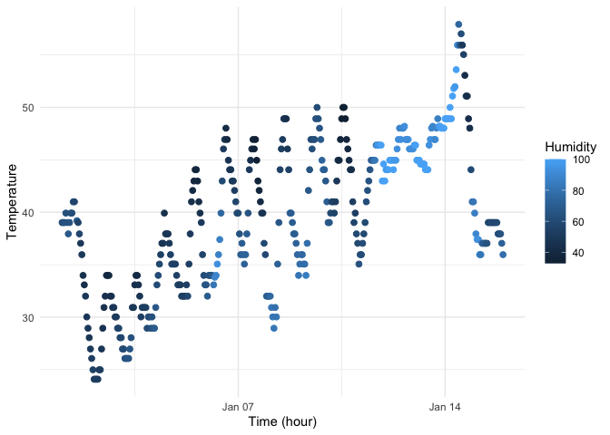

p8105_hw1_mk5149
================
Mungyu Kwok
2025-09-16

This is the R markdown file for Homework 1, P8105 Data Science, created
by Mungyu Kwok on September 16th 2025.

Firstly, we load any necessary library that we will use in this file.

``` r
library(tidyverse)
```

    ## ── Attaching core tidyverse packages ──────────────────────── tidyverse 2.0.0 ──
    ## ✔ dplyr     1.1.4     ✔ readr     2.1.5
    ## ✔ forcats   1.0.0     ✔ stringr   1.5.1
    ## ✔ ggplot2   3.5.2     ✔ tibble    3.3.0
    ## ✔ lubridate 1.9.4     ✔ tidyr     1.3.1
    ## ✔ purrr     1.1.0     
    ## ── Conflicts ────────────────────────────────────────── tidyverse_conflicts() ──
    ## ✖ dplyr::filter() masks stats::filter()
    ## ✖ dplyr::lag()    masks stats::lag()
    ## ℹ Use the conflicted package (<http://conflicted.r-lib.org/>) to force all conflicts to become errors

``` r
library(moderndive)
```

# Problem 1

We start problem 1 by loading the data from the `early_january_weather`.

``` r
# Load the data
data("early_january_weather")
```

Next, we extract the essential information about the dataset: variable
names, number of wors & columns, and compute the mean temperature.

``` r
# Get the information about the dataset
names(early_january_weather)   # variable names
```

    ##  [1] "origin"     "year"       "month"      "day"        "hour"      
    ##  [6] "temp"       "dewp"       "humid"      "wind_dir"   "wind_speed"
    ## [11] "wind_gust"  "precip"     "pressure"   "visib"      "time_hour"

``` r
nrow(early_january_weather)    # number of rows
```

    ## [1] 358

``` r
ncol(early_january_weather)    # number of columns
```

    ## [1] 15

``` r
mean(early_january_weather$temp, na.rm = TRUE)   # mean temperature
```

    ## [1] 39.58212

The `early_january_weather` dataset contains 358 rows and 15 columns.  
Important variables include `origin`, `year`, `month`, `day`, `hour`,
`temp`, `dewp`, `humid`, `wind_dir`, `wind_dir`, `wind_speed`,
`wind_gust`, `precip`, `pressure`, `visib` and `time_hour`.  
The mean temperature during this period was 39.5821229 degrees
Fahrenheit.

Based on the information obtained, we compute a scatterplot (time versus
temperature).

``` r
# Generate the scatter plot
scatter_temp_time <- ggplot(early_january_weather, 
                           aes(x = time_hour, y = temp, color = humid)) + geom_point(size = 2) + 
  labs(x = "Time (hour)", y = "Temperature", color = "Humidity") + theme_minimal()
scatter_temp_time
```

<!-- -->

``` r
ggsave("scatter_temp_vs_time.png", scatter_temp_time, width = 7, height = 4)
```

The scatterplot shows the relationship between time (x-axis) and
temperature (y-axis) in early January, with point color indicating
humidity. Temperatures generally increased over the course of the two
weeks, although fluctuations occurred within each day. Higher humidity
values (lighter blue points) appear more often during periods of higher
temperature, especially in the second week of January. Overall, the plot
suggests a warming trend accompanied by varying levels of humidity.

# Problem 2

We first create 4 vectors: a numeric vector (10 random samples from the
standard normal distribution), a logicala vector indicating whether
elements of the sample are greater than 0, a character vector of length
10, a factor vector of length 10, with 3 different factor “levels”.

``` r
# Create the numeric vector
numeric_vec = rnorm(10)

# Create the logical vector, TRUE if numeric_vec > 0
logical_vec = numeric_vec > 0

# Create the character vector
character_vec = c("a","b","c","d","e","f","g","h","i","j")

# Create the factor vector
factor_vec = factor(c("low","medium","high","low","medium","high","low","medium","high","low"))
```

Then, we combine them into a dataframe.

``` r
df = tibble(
  numeric_vec,
  logical_vec,
  character_vec,
  factor_vec
)
df
```

    ## # A tibble: 10 × 4
    ##    numeric_vec logical_vec character_vec factor_vec
    ##          <dbl> <lgl>       <chr>         <fct>     
    ##  1     -0.871  FALSE       a             low       
    ##  2      0.804  TRUE        b             medium    
    ##  3     -0.0801 FALSE       c             high      
    ##  4     -1.01   FALSE       d             low       
    ##  5     -0.609  FALSE       e             medium    
    ##  6      1.09   TRUE        f             high      
    ##  7     -1.41   FALSE       g             low       
    ##  8      0.326  TRUE        h             medium    
    ##  9     -1.13   FALSE       i             high      
    ## 10     -0.552  FALSE       j             low
